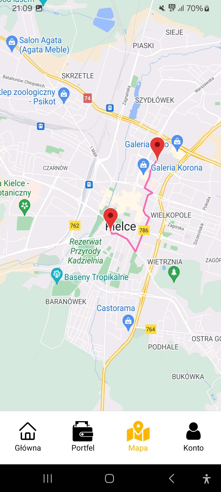
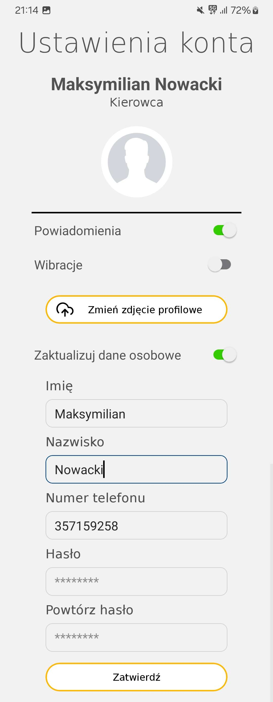

# YellowCabs

YellowCabs is an mobile application which is simulating an real mobile app to ride as a taxi driver or booking an taxi courses as passenger. 

## Installation

Clone the project into your local machine using following command: 

```bash
https://github.com/miluski/YellowCabs.git
```

Then, in terminal, provide this command to install node_modules packages:

```bash
npm install
```

You will need also a file named api.config.js in root directory of the project and provide to it above informations:

```javascript
export const FirebaseApiCredentials = {
    apiKey: "YOUR_FIREBASE_API_KEY",
    appId: "YOUR_FIREBASE_APP_ID", 
    projectId: "YOUR_FIREBASE_PROJECT_ID",
    databaseURL: "YOUR_FIREBASE_DATABASE_URL",
    storageBucket: "YOUR_FIREBASE_STORAGE_URL"
}
export const GoogleApiCredentials = {
    apiKey: "YOUR_GOOGLE_API_KEY"
}
```

Used google apis: Places API, Directions API, Distance Matrix API, Geocoding API. Your google api key must have access to mentioned apis.

## Usage

To use this app you will need expo go app installed on your phone or emulated phone. You can run the app via expo, but first you need to run a metro bundler using this command in terminal:

```bash
npx expo --go --tunnel
```

or if you want use it only in LAN:

```bash
npx expo --go
```

## Screenshoots








## License

[MIT](https://choosealicense.com/licenses/mit/)